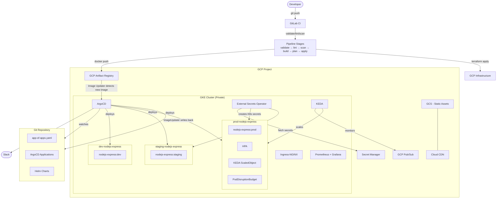

# Architecture

## System Architecture



## Component Breakdown

### Infrastructure Layer (Terraform)

| Component | Implementation | Notes |
|-----------|---------------|-------|
| VPC | `google_compute_network` | Custom VPC, no auto-create subnets |
| Subnet | `google_compute_subnetwork` | Private nodes, secondary ranges for pods/services |
| NAT | `google_compute_router_nat` | Outbound internet for private nodes |
| GKE Cluster | `google_container_cluster` | Private nodes, Workload Identity, VPC-native |
| Node Pool | `google_container_node_pool` | Autoscaling, shielded nodes, surge upgrade |
| Artifact Registry | `google_artifact_registry_repository` | Docker format, cleanup policies |
| Secret Manager | `google_secret_manager_secret` | Per-environment secrets |
| Cloud CDN | `google_compute_backend_bucket` | Static assets via GCS backend |

### Platform Layer (Kubernetes)

| Component | Namespace | Purpose |
|-----------|-----------|---------|
| ArgoCD | `argocd` | GitOps controller, App of Apps |
| ArgoCD Image Updater | `argocd` | Auto-detect new images in Artifact Registry |
| External Secrets Operator | `external-secrets` | Bridge GCP Secret Manager → K8s Secrets |
| KEDA | `keda` | Event-driven autoscaling (Pub/Sub) |
| Ingress-NGINX | `ingress-nginx` | HTTP/HTTPS ingress |
| Prometheus + Grafana | `monitoring` | Metrics and dashboards |

### Application Layer (Helm + GitOps)

| Environment | Namespace | Sync Policy | Image Update Strategy |
|-------------|-----------|-------------|----------------------|
| dev | `dev-nodejs-express` | Auto | newest-build |
| staging | `staging-nodejs-express` | Auto | semver |
| prod | `prod-nodejs-express` | Manual | digest |

## Network Architecture

```
Internet
    │
    ▼
Cloud Load Balancer (L7)
    │
    ▼
Ingress-NGINX (ClusterIP via NEG)
    │
    ▼
[NetworkPolicy: allow ingress-nginx → port 3000]
    │
    ▼
Node.js Express Pods (Private Node Pool)
    │  ─── envFrom ConfigMap
    │  ─── envFrom Secret (via ESO ← Secret Manager)
    │
    ▼
External Services via NAT Gateway
```

## Secret Flow

```
GCP Secret Manager
    │
    │  (Workload Identity binding)
    ▼
External Secrets Operator (ClusterSecretStore)
    │
    │  (ExternalSecret CR → creates K8s Secret)
    ▼
Kubernetes Secret (per namespace)
    │
    │  (envFrom secretRef)
    ▼
Application Pod
```

## Image Update Flow (GitOps)

```
Developer pushes code
    │
    ▼
GitLab CI builds & pushes image
tag: europe-west1-docker.pkg.dev/PROJECT/repo/app:abc1234
    │
    ▼
ArgoCD Image Updater detects new image
(polls Artifact Registry every 2 min)
    │
    ▼
Image Updater writes back to Git
(updates image.tag in values file via commit)
    │
    ▼
ArgoCD detects Git change
    │
    ▼
ArgoCD syncs Helm release → Rolling Update
    │
    ▼
Slack notification: ✅ Deployed
```

## KEDA Pub/Sub Autoscaling

```
GCP Pub/Sub Subscription
    │  (unacknowledged message count)
    ▼
KEDA ScaledObject trigger
(threshold: 50 messages)
    │
    ├─ < 50 msgs   → minReplicaCount (3)
    ├─ 50-500 msgs → scales up proportionally
    └─ > 500 msgs  → maxReplicaCount (20)
         │
         ▼
    Pod replicas adjusted
    (cooldownPeriod: 60s, pollingInterval: 30s)
```
